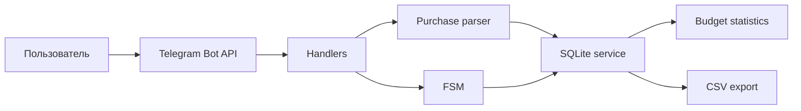

<h1 align="center">SpendNote</h1>

<p align="center">Telegram-бот для планирования покупок, контроля бюджета и учёта расходов</p>

<p align="center">
  
  
  
  
</p>

## О проекте

SpendNote превращает обычное сообщение пользователя в структурированную запись о покупке. Бот извлекает название, стоимость, категорию, приоритет, статус и заметку, сохраняет данные в персональную SQLite-базу и рассчитывает состояние месячного бюджета.

Проект демонстрирует обработку свободного текста, разделение пользовательских данных, работу с состояниями диалога и экспорт данных.

## Возможности

- добавление покупки одной строкой;
- пошаговый сценарий через FSM;
- извлечение цены и заметки из текста;
- автоматическое определение категории, статуса и приоритета;
- статусы «В плане», «Куплено» и «Отложено»;
- месячный бюджет и расчёт остатка;
- статистика по категориям;
- CSV-экспорт;
- inline-действия: купить, отложить или удалить;
- изоляция данных по Telegram `user_id`;
- SQLite без внешней инфраструктуры.

## Примеры

```text
хочу кроссовки 9000 одежда важно
купил кофе 250 еда
наушники 12000 техника заметка: посмотреть скидки
такси 700 транспорт
```

## Технологии

| Компонент | Технология |
|---|---|
| Telegram-интерфейс | aiogram 3 |
| Обработка текста | Python, регулярные выражения |
| Хранилище | SQLite |
| Сценарии ввода | aiogram FSM |
| Конфигурация | python-dotenv |
| Проверка ядра | smoke test |

## Архитектура



## Структура проекта

```text
main.py                 # точка входа
handlers/               # Telegram-сценарии
keyboards/              # reply- и inline-кнопки
services/db.py          # схема SQLite, миграции и запросы
services/parser.py      # разбор свободного текста
services/fsm.py         # состояния диалогов
scripts/smoke_test.py   # проверка базы, парсера и статусов
```

## Команды

```text
/start          главное меню
/add            добавить покупку
/list           покупки в плане
/list bought    купленные покупки
/list all       все записи
/buy ID         отметить покупку купленной
/skip ID        отложить покупку
/delete ID      удалить покупку
/budget 60000   установить месячный бюджет
/stats          статистика и остаток
/export         экспорт CSV
/clear          удалить свои данные
/help           помощь
```

## Установка

```bash
git clone https://github.com/loLy69/spendnote-telegram-bot.git spendnote
cd spendnote
python -m venv .venv
```

Windows PowerShell:

```powershell
.\.venv\Scripts\Activate.ps1
pip install -r requirements.txt
Copy-Item .env.example .env
```

Linux и macOS:

```bash
source .venv/bin/activate
pip install -r requirements.txt
cp .env.example .env
```

Добавьте токен:

```env
BOT_TOKEN=your_telegram_bot_token
```

Запуск:

```bash
python main.py
```

## Проверка

```bash
python -m compileall -q .
python scripts/smoke_test.py
```

Smoke-тест проверяет парсер, временную базу, добавление покупки, смену статуса и расчёт итогов.

## Развёртывание

Для постоянной работы рекомендуется Ubuntu VPS и `systemd`. Файл `.env`, база SQLite, логи и CSV-экспорты не должны добавляться в Git.

## Ограничения текущей версии

- категории определяются словарём и регулярными выражениями, без ML-модели;
- используется локальная SQLite-база;
- нет Docker-конфигурации;
- smoke-тест не заменяет полноценный набор unit- и integration-тестов;
- CI и централизованный мониторинг пока не настроены.

## Возможности развития

- Docker и автоматический deploy;
- pytest и GitHub Actions CI;
- PostgreSQL для масштабирования;
- регулярные расходы и финансовые цели;
- графики и отчёты;
- импорт банковских операций;
- локализация интерфейса.

## Контакты

- Дмитрий — Telegram: [@nigGats9](https://t.me/nigGats9)
- Виктория, менеджер проекта — [viculence@yahoo.com](mailto:viculence@yahoo.com)
